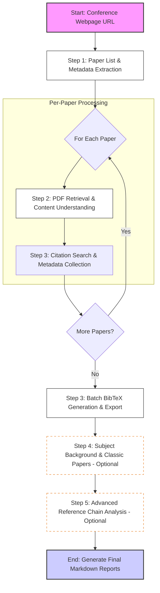

# Conference Analysis Plugin

This plugin provides academic paper analysis capabilities for conferences.

## Paper Report Skill Workflow

The following flowchart describes the automated process of generating a paper analysis report from a conference URL:

## Key Components

- **Metadata Extraction**: Primarily uses the [extract_papers.py](skills/paper-report/scripts/extract_papers.py) script with **Crawl4AI** to convert conference pages into structured content and generate `papers.json`.
- **PDF Retrieval**: Integrates `paper-search-mcp` and `academic-mcp` to find and download full-text PDFs.
- **Batch BibTeX**: Optimized process using the [batch_bibtex.py](skills/paper-report/scripts/batch_bibtex.py) script to search DBLP and export a unified `.bib` file, replacing multiple manual MCP calls.
- **Reference Analysis**: (In development) Specialized tools for citation graph exploration.
